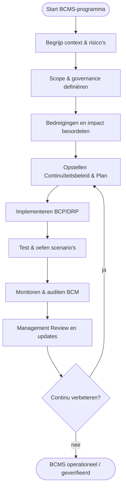

# Executive Summary

Een **Business Continuity Management System (BCMS)** volgens ISO 22301 helpt organisaties om verstoringen (calamiteiten, cyberincidenten, uitval) **te minimaliseren en snel te herstellen**. De norm ISO 22301 legt een PDCA-cyclus vast voor continuïteit: van beleid en risicoanalyse (Plan), via implementatie van maatregelen (Do), toetsing door testen/audits (Check) tot bijsturen (Act)【35†L532-L540】. Dit sluit aan bij Europese eisen (NIS2 richt BCP vráágteplicht op veerkracht en meldcapaciteit) en Nederlandse kaders (BIO schrijft BCP’s voor kritieke processen voor)【32†L91-L100】【45†L2773-L2780】. 

Stappen voor implementatie zijn onder meer: **stakeholderanalyse en scopebepaling**, **risico-inventarisatie (impactanalyse)**, **continuïteitsplan ontwikkelen (incl. Recovery Plan, Crisisplan)**, **opleiden en oefenen**, en **monitoren/auditen van effectiviteit**. Per stap is concreet beschreven: doel, activiteiten, vereiste rollen (BCO/CRCO, IT, proceseigenaren, e.d.), deliverables (risicoregisters, BCP/DRP, testverslagen, beleidsdocumenten), tijdindicaties, middelen (BCM-tools, DR-tests, communicatieplatforms), risico’s (bijv. gebrek aan oefenroutine) en mitigaties (bijv. management buy-in). 

Vergelijking ISO 22301–NIST/ENISA: ISO 22301 specificeert een managementsysteem met toetsbare eisen; NIST SP800-34 geeft technische richtlijnen (back-ups, alternatieve locaties)【45†L2811-L2818】. ENISA/NIS2 noemen ISO 22301 expliciet als voorbeeld voor BCP【45†L2786-L2794】【32†L130-L139】 en benadrukken testen en middelen voor herstel. For Europese organisaties geldt dat een solide BCMS niet alleen ISO‑certificering mogelijk maakt, maar ook helpt voldoen aan NIS2- en BIO2-eisen (respectievelijk continuïteit en overheid security)【32†L91-L100】【45†L2811-L2818】. 

Praktijkvoorbeelden laten zien dat organisaties met een BCMS (en ISO‑22301 certificering) kortere herstelroutes bereiken en verbeterde bestuurlijke sturing hebben over continuïteit. Kleinere bedrijven kunnen starten met een beknopte scope en sjablonen, grotere juist met formele governance en ingewikkelde chain-dependencies. Hieronder volgt een volledige uitwerking met tabellen, een Gantt-roadmap en flowcharts om elke stap van het BCMS-aanpak te illustreren.

## Normatieve en wettelijke context

### ISO 22301 en internationale standaarden

ISO 22301:2019 is dé internationale norm voor **Business Continuity Management Systems** (BCMS)【35†L509-L517】. Hij definieert bedrijfscontinuïteit als “het vermogen om tijdens een verstoring producten en diensten te blijven leveren binnen acceptabele tijdsbestekken”【35†L509-L517】. ISO 22301 verplicht organisaties tot een procesmatige aanpak (PDCA【35†L532-L540】) voor preventie, voorbereiding en herstel. 

In de norm staat bijvoorbeeld dat organisaties een **continuïteitsplan (BCP)** en bijbehorend **herstelplan (DRP)** moeten opstellen, gebaseerd op een risico-analyse【45†L2773-L2780】【45†L2786-L2794】. Deze plannen bevatten scope, rollen, herstelvolgorde, communicatie, enz. ISO 22301 verwijst zelf naar ISO 22313 (guidance) en zie ook de NIST SP800-34 (voor technische backup/wijzigingsrichtlijnen)【45†L2811-L2818】. 

### EU/Nederland: NIS2, BIO2 en overige

De **NIS2-richtlijn** (tweede EU Cybersecurityrichtlijn) verplicht essentiële/dienstverlenende organisaties tot maatregelen voor continuïteit【32†L130-L139】. Concreet zegt NIS2 (art.18) dat organisaties “passen maatregelen nemen voor bedrijfscontinuïteit en incidentrespons” en testen van plannen【32†L130-L139】【45†L2773-L2780】. NIS2-executieve regelgeving (EU 2024/2690) noemt ISO 22301 expliciet als voorbeeldnorm voor BCP-eisen【45†L2811-L2818】. Incidents met grote impact moeten bovendien gemeld worden (NIS2 art.20). 

Voor **overheden** gelden de BIO-standaarden. De **BIO2** schrijft expliciet voor dat organisaties “plannen opstellen, implementeren en onderhouden om continuïteit te garanderen”【32†L91-L100】. Kernvereisten zijn dan het vaststellen van cruciale processen, risicoanalyse, een gedocumenteerd BCP met herstelmaatregelen, en regelmatige testen/evaluatie【32†L91-L100】. De herziening (BIO2) zal deze continuïteitsmaatregelen behouden【32†L112-L119】. 

Andere relevante regels:  
- **DORA** (financiële sector): verplicht ook continuïteitsmaatregelen voor ICT-diensten, erg relevant voor banken/verzekeraars maar minder voor gemeenten.  
- **AVG/GDPR**: geen directe BCM-eis, maar privacy-breaches en datalekken vereisen eigen incidentrespons (wel overlapping).  
- **Cyberbeveiligingswet**: transpositie van NIS2 in Nederland; houdt onder meer de meldplicht in; BCM ondersteunt de weerbaarheid (zie NCTV en NCSC adviezen).  
- **AP-richtlijnen**: geen BCM-expliciet, maar vaak eisen eenduidige procedures en verantwoording bij incidenten (DORA/NIS2 gerelateerd). 

Kortom: ISO 22301 is het hoekstenen-normenkader; NIS2 en BIO zetten die om in concrete wettelijke verplichtingen voor (overheids)organisaties【32†L91-L100】【45†L2811-L2818】. ENISA’s Technical Guidance voor NIS2 bevestigt het belang van BCP/DRP (Art.21 NIS2) en noemt ISO 22301 als best practice【45†L2773-L2780】【45†L2811-L2818】.

## ISO 22301 versus NIST/ENISA-benaderingen

- **Norm vs technische gids**: ISO 22301 is een **managementsysteemnorm** met eisen voor rollen, beleid, documentatie en proces. NIST SP800-34 is bijvoorbeeld vooral technisch gericht op IT-continuïteit (back-ups, failover) en voorziet in specifieke praktijktips【45†L2811-L2818】. ISO 22301 kan gezien worden als het overkoepelende raamwerk; NIST-tools vullen aan waar nodig. 

- **PDCA-cyclus**: Beide erkennen het belang van planmatig werken. ISO 22301 expliciteert PDCA voor BCM (Plan/Do/Check/Act)【35†L532-L540】. ENISA/NIS2 technisch advies komt hierop overeen: plannen testen (Check) en verbeteren (Act) zijn verplicht【45†L2773-L2780】【45†L2811-L2818】. 

- **Scope van continuïteit**: ISO 22301 focust op álle operationele processen; NIST SP800-34 en NIST Cybersecurity Framework spreken vooral IT. Organisaties combineren doorgaans ISO 22301 met deze frameworks voor sectorkennis. (Opmerking: ENISA’s guidance wijst ook op NIST SP800-34 als relevant bewijsvoering【45†L2811-L2818】.)

- **Certificering en aantoonbaarheid**: ISO 22301 is beoordeelbaar door certificatie. NIS2/CyberAct/METIS-compliance kan getoond worden via ISO 22301 compliance. ENISA noemt ISO 22301 als “industry-recognized standard” in het toetsingskader【45†L2811-L2818】. Certificering zelf is niet wettelijk verplicht maar versterkt wel het bewijs voor toezichthouders.  

Al met al is ISO 22301 de hartslag, met NIST/ENISA adviezen als verdiepende inhoud. In de praktijktabel hieronder zijn NIS2 en BIO2 verweven met ISO-eisen: bijvoorbeeld “plan regelmatig testen” komt uit alle drie de bronnen【32†L91-L100】【45†L2773-L2780】. 

## PDCA-implementatie van een BCMS

De BCMS-aanpak is cirkelvormig (PDCA). Onderstaand flowchart vat samen:



### 1. Plan: Initiatie & scope

**Doel:** Bestuurlijke steun organiseren en bepalen wat binnen het BCMS valt.

**Activiteiten:**  
- **Beleid en mandaat:** Stel beleid vast voor continuïteit (BCM-policy) en ken mandaat toe aan een Continuïteitsmanager/Coördinator. Bürkt lead/commitment (NIS2 vereiste) en goedkeuring van MT.  
- **Scopebepaling:** Identificeer kritieke bedrijfsprocessen en afhankelijkheden (IT-systemen, leveranciers, locaties). Vaak gebruikt men Business Impact Analyses (BIA) om prioriteiten te stellen【32†L91-L100】.  
- **Stakeholders:** Benoem crisisteam (bijv. CISO/BCO, OT-manager, communicatie, HR), inclusief externe partijen (brandweer, leveranciers). Definieer rollen (RACI).  
- **Risicokader:** Bepaal risicobereidheid en methodiek (frequenties, effecten). Leid dit af uit BIO/NIS2-verplichtingen (bijv. risicoanalyse voor BCP【32†L91-L100】). 

**Rollen/competenties:** Directie/MT (richtlijnen), Continuïteitsmanager (BCO/CRCO), Proceseigenaren (invoer BIA), IT/Netwerkbeheer (technische impact), HR/Communicatie (crisiscommunicatie)【32†L91-L100】.

**Deliverables:** BCM-beleidsdocument, scope- en stakeholderregistratie, risicobereidheid-besluit. Template: beleidssjabloon met scope-afbakening, BCM organogram.

**Tijdindicatie:** Klein: ~2–4 weken; Middel: ~4–8 weken; Groot: ~8–12 weken (complexiteit). Onzekerheid door bestuurlijke besluitvorming en volledige analyse.

**Middelen/tools:** Workshopruimte, risicomanagementsoftware, threat intelligence bronnen (weer, cyber). 

**Risico’s/mitigaties:** Gebrek aan managementaandacht (zorg voor top-down motivatie). Onvolledige scope (gebruik BIA-checklist, betrek alle afdelingen). 

**Succescriteria:** Beleid goedgekeurd; alle kritieke processen benoemd (BCP-initiatielijst); respons-team samengesteld.

### 2. Do: Risicoanalyse & Continuïteitsplanning

**Doel:** Uitwerken welke verstoringen mogelijk zijn en hoe te reageren (BCP/DRP opstellen).

**Activiteiten:**  
- **Business Impact Analyses (BIA):** Identificeer de gevolgen van uitval per proces (downtime costs, wettelijke verplichtingen). Classificeer processen (high/medium/laag impact).【32†L91-L100】  
- **Risicoanalyse:** Bepaal bedreigingen (brand, cyberaanval, stroomuitval) per proces en de kans van optreden. Wees risicogebaseerd zoals NIS2 eist.  
- **Continuïteitsstrategieën:** Formuleer maatregelen: workarounds, redundantie (stand-by systemen, alternatieve locaties), back-ups, failover. (NIST SP800-34, ISO 22301 aanbevelen deze【45†L2811-L2818】.)  
- **Opstellen BCP en DRP:** Documenten met procedures voor respons en herstel. Het BCP bevat scope, rollen, communicatie; het DRP behandelt IT-specifiek herstel (servers, datacenters). Beide planvolgorde & recovery time objectives (RTO/RPO).【45†L2786-L2794】  
- **Incident en crisisplan:** Voor crissituaties, inclusief communicatie (wie informeert personeel/publiek/leveranciers), evaluatiecriteria voor opschalen.  
- **Integratie met leveranciers:** Evalueer kritieke leveranciers/ketenpartijen en garandeer continuïteit (contractuele afspraken, tweede-sourcing). NIS2 benadrukt ketencontinuïteit【44†L24-L30】.

**Rollen/competenties:** Continuïteitscoördinator (opstellen plannen), IT en OT (verantwoordelijk voor technische recovery), Veiligheidscoördinator (brand, rampenplannen), Juridisch/Compliance (wettelijke hersteltijden).  

**Deliverables:** BIA-rapport, Risicoregister BCM, Business Continuity Plan (BCP), Disaster Recovery Plan (DRP), Crisisplan. Templates: standaard BCP-indeling (doel, scope, procedures), DRP-checklist. Tabel format voor BIA met impact/kans-scores.

**Tijdindicatie:** Klein: ~2–3 maanden; Middel: ~4–6 maanden; Groot: ~6–12 maanden. Variatie door aantal processen en noodzakelijke tests. Onzekerheid door externe afhankelijkheden (leveranciers).

**Middelen/tools:** BIA-software of Excel-templates, threat libraries (brand, cyber, klimaatgegevens), architectuurdiagrammen, DR-infrastructuur (backupservers, failover). 

**Risico’s/mitigaties:** Gebrekkige risicobeoordeling (gebruik gestandaardiseerde BIA)【45†L2773-L2780】. Onrealistische herstelstrategieën (evalueer haalbaarheid met IT). Gebrek aan contractuele continuïteitsgaranties (betrek inkoop vroeg).

**Succescriteria:** Compleet BIA uitgevoerd (≥90% kritieke diensten geclassificeerd). BCP/DRP gedocumenteerd en goedgekeurd. RTO/RPO per proces vastgelegd.

### 3. Do: Implementatie & Training

**Doel:** Zorg dat de in stap 2 geplande maatregelen écht werken en medewerkers weten wat ze moeten doen.

**Activiteiten:**  
- **Technische maatregelen inrichten:** Installeer en test redundante systemen, back-upprocessen, alternatieve locaties of cloudservices, noodstroomgeneratoren. Zorg voor goede fysieke beveiliging van die alternatieven. (ISO 22301: "verzeker redundantie en failover"【32†L173-L181】).  
- **Processen inbedden:** Stel procedures op voor incidentresponse, BCP-activering, communicatie. Leg taken en beslisschema’s vast.  
- **Trainings- en oefenprogramma:** Organiseer oefeningen (tabletop, walkthrough, full-scale drills) voor alle niveaus, van simulatie van stroomuitval tot cyberaanval. Benoem evaluatieteams. Dit is cruciaal: “regelmatig testen en evalueren” staat in BIO, NIS2 en ISO22301【32†L108-L115】【32†L173-L181】.  
- **Communicatie:** Informeer interne en externe belanghebbenden (stakeholders). Publiceer crisiscontacten en protocollen. Zorg dat sleutelmensen kunnen bellen/mailen als systemen uitvallen (zowel offline als online kanalen).  
- **Integratie met ISMS:** Zorg dat continuïteit onderdeel is van Security Incident & Response Management (NIS2 vereist incidentmelding). Stem de BCP-acties af met de bestaande IT-beveiligingsprocedures.  
- **Leveranciers & keten:** Implementeer back-up scenario’s bij kritieke leveranciers. Voer regionale/sector-oefeningen uit met partners (bv. nutsbedrijven, hulpdiensten).  

**Rollen/competenties:** IT/ICT-specialisten (technische uitvoering), Crisismanagers, Communicatie-experts, Externe consultants (bv. fysieke veiligheid), HR (oefenschema, training). 

**Deliverables:** Geconfigureerde infrastructuur (backupdiensten, extra hardware), Operationele procedures (respons, failover-steps), Oefenlogs en -verslagen, Communicatieplannen. Templates: oefenplan-sjabloon, incident logformulier.

**Tijdindicatie:** Klein: ~1–2 maanden (simpel netwerk, één locatie). Middel: ~3–6 maanden. Groot: ~6–12 maanden (multi-site, complexe IT). Onzekerheid door afhankelijkheid hulpdiensten/planners.

**Middelen/tools:** Oefenomgeving (test-IT), noodcommunicatiekanalen (bv. satelliettelefoon, radio), train-de-trainer programma’s, samenwerkingstools (videoconferentie, mass-alarmering).

**Risico’s/mitigaties:** Weerstand of verzuim bij trainingen (plan voor alle dienstroosters). Onvoldoende realistische tests (gebruik scenario’s gebaseerd op BIA-resultaten).  

**Succescriteria:** 100% kritische functies hebben minstens 1 oefening gehad; alle leerpunten verwerkt. Technische redundantie-functioneel (backuptesten met gedefinieerde RTO)【45†L2786-L2794】. 

### 4. Check: Monitoren & Evaluatie

**Doel:** Controleren of BCMS-maatregelen effectief zijn en blijvend adequaat.

**Activiteiten:**  
- **Audits en reviews:** Voer interne BCM-audits uit op beleid, BCP en implementatie. Inspecteer of procedures worden gevolgd. Leg bevindingen vast en plan correcties. ISO 22301 vereist interne audits en managementreviews.  
- **Managementreview:** Regelmatig (jaarlijks) bestuurlijk overleg over continuïteitsstatus, bevindingen en noodzakelijke middelen. Besluit op basis van KPI’s en auditresultaten.  
- **Oefenen en valideren:** Herhaal en varieer exercises; beoordeel de uitkomsten. Een jaarlijkse volledige driptest wordt aanbevolen【45†L2773-L2780】【45†L2811-L2818】. Verwerk bevindingen: pas plannen aan waar nodig.  
- **Verslagen en metrics:** Houd KPI’s bij zoals testfrequentie, opleveringstijd na incident, percentage up-to-date back-ups. Gebruik dashboards.  
- **Incidentanalyse:** Analyseer elke werkelijke verstoring (cyberaanval, stroomuitval): wat werkte wel/niet? Documenteer lessons learned.  
- **Externe toetsing:** Bereid voor op externe audit/certificering. Demonstraties van compliance (bijv. voor NEN of gemeente) met logs van BCP-acties.  

**Rollen/competenties:** Interne auditor (ISO22301), Crisisteamleden (evaluatie), IT Operations (rapportage downtime), MT (besluitvorming).  

**Deliverables:** Auditrapport(en) en bevindingenlog, Management Review rapport met verbeterslijsten, Geactualiseerde BCP/DRP (na test/incident), Continual improvement plan. Tabel: KPI-dashboard voor BCM. 

**Tijdindicatie:** Start binnen 3–6 maanden na implementatie (eerste audit/ oefencyclus). Daarna herhaal jaarlijks of na iedere grote wijziging.  

**Middelen/tools:** Audit/GRC modules, Oefensoftware, rapportagetools, logging van failover events.

**Risico’s/mitigaties:** Niet opvolgen advies uit oefeningen (zet opvolgingsplan met deadlines). “Auditmoeheid” na 1-2 jaar (varieer de scenario’s, betrek externe partijen).  

**Succescriteria:** Major bevindingen direct opgelost; managementbewustzijn hoog (besluitvorming/documentatie). Continue verbeteracties in backlog. 

### 5. Act: Verbeteren & Certificeren

**Doel:** BCMS continu verbeteren en externe audittraject afronden.

**Activiteiten:**  
- **Correctieve acties (CAPA):** Implementeer snelle correcties voor tekortkomingen uit auditeresultaten of echte incidenten. Hertrain personeel indien procesblunders.  
- **Ketenoptimalisatie:** Onderzoek en versterk zwakke schakels in de keten (bijv. enige datacenter, afhankelijkheid leverancier). Pas contracten aan.  
- **Documentatie updaten:** Na elke grote wijziging (organisatie, IT, regelgeving) BCP bijwerken.  
- **Voorbereiding ISO 22301-certificering:** Verzamel bewijslast (logs van BCP-acties, auditrapporten, testverslagen). Laat eventueel pre-audit uitvoeren. Plan Stage 1 (documentreview) en Stage 2 (systeemtest) audit met een certificerende instelling.  
- **Communicatie & cultuur:** Blijf bewustzijn bevorderen; vierde (bijv. bij ISO-certificering) successen vieren om buy-in te versterken.

**Rollen/competenties:** Alle eerdergenoemde; plus Externe Auditor (certificaatproces), Beleidsmakers (besluiten voor grote investeringen), Communicatie (uiteenzetting resultaatsverbeteringen).  

**Deliverables:** Verbeterregister (CAPA met statussen), Geüpdatete risicoanalyses, Certificeringsrapport(en) Stage 1/2. Tabel: certificeringsplanning en scope.

**Tijdindicatie:** Afhankelijk van auditplanning: ISO-certificeringstraject ca. 3–6 maanden als alle maatregelen gereed zijn. Continue verbetering: doorlopend.

**Succescriteria:** Binnen afgesproken termijnen wordt aan alle interne auditbevindingen voldaan. ISO 22301-certificaat behaald (optioneel maar valt onder beste praktijken) of geslaagde externe review.  

## Deliverables, templates en risicomatrix

Voor overzicht zijn hier de kern-deliverables uitgezet, inclusief wie ze oplevert en voorbeeldinhoud.

| Deliverable                  | Fase          | Inhoud (template/voorbeeld)                    | Eigenaar           | Bewijs/evidentievorm        |
|------------------------------|---------------|-----------------------------------------------|--------------------|-----------------------------|
| BCM-beleidsdocument          | Plan          | Beleidsverklaring, doelstelling, scope, rollen | Directie/BCO       | Geaccordeerd document       |
| Scope- & stakeholderregister | Plan          | Lijst kritieke processen, leveranciers, regs   | BCO/Continuïteitsmanager | Werkbladen/ IT-arch.     |
| Business Impact Analyses     | Plan/Do       | Impacttabel (proces vs recovery metrics)      | Proces-eigenaren/ Riskteam | BIA-rapport             |
| Continuïteitsplan (BCP)      | Do (Implement.) | Stappenplan herstel, RTO/RPO, communicatiestructuur | BCO/IT-manager    | Gepubl. BCP-document        |
| Disaster Recovery Plan (DRP) | Do           | Technische recoverystappen (data, netwerken)   | IT/Netwerkbeheer    | DRP-document               |
| Crisiscommunicatieplan       | Do           | Wie informeren, informatiekanalen, spraakteksten | Communicatie/BCO  | Communicatieprotocol       |
| Oefenplannen en -rapporten   | Check        | Scenario-oefeningen en testverslagen          | Oefen-coördinator   | Registraties, verslagen   |
| Audit- en reviewrapporten    | Check        | Auditbevindingen, KPI-rapportage              | Internal auditor    | Auditlog, KPI-dashboard    |
| Management review dossier    | Check/Act    | Actiepuntenlijst, besluitenlijst              | MT/BCO             | Notulen en besluitregister  |
| Correctielijst (CAPA)        | Act          | Afspraken/acties na audit of incident         | Continuïteitsmanager | CAPA-register            |

**Templates:** Stel standaardformulieren op: BIA-sheet, BCP-layout (doel, omvang, gevolg, herstelstrategie), DRP-checklist, oefen-logboek. Gebruik de ISO 22301-structuur (bijv. Plan-analyse, Do-implementatie, Check-test, Act-review). 

**Risicomatrix (voorbeeld):**

| Risico                                          | Impact | Kans | Score | Mitigatie                                   |
|-------------------------------------------------|--------|------|-------|---------------------------------------------|
| Geen topmanagement-commitment                   | Hoog   | Matig| 12    | Bestuurlijke workshops; BNK/Champions aanstellen  |
| Onvolledig BIA of verkeerde prioritering        | Hoog   | Matig| 12    | Beta-test BIA met meerdere afdelingen         |
| Slechte IT- of datakwaliteit (geen backup)      | Hoog   | Matig| 15    | Auditen IT-beveiliging; redundantietechnieken |
| Trage leveringen alternatieve locaties           | Middel | Hoog | 12    | Vroegtijdige contracten & leveranciersoefening |
| Oefeningen slecht gevolgd (learnings vergeten)  | Middel | Matig| 9     | Verplicht evaluaties na elke oefening         |

*Risico’s* worden geclassificeerd op impact/kans, met opvolgacties. Zo kan bijvoorbeeld een lage oefenfrequentie (risico “onvoldoende getraind personeel”) worden gemitigeerd door een jaarlijkse oefenplanverplichting in het beleid.

## Tooling en middelen

Essentiële hulpmiddelen voor een BCMS:

- **BCM/BCP-software** (bijv. Continuity2, Fusion Framework): registreert plannen, simulaties, contactlijst, alarmsystemen.  
- **IT- en netwerktools:** Back-upsoftware (image/ data), virtualisatie voor snel failover, cloud-D/R diensten.  
- **Communicatietools:** Noodcommunicatie (mass notifications, sms, radio), crisis-room voorzieningen.  
- **Oefen- en testsystemen:** Simulatie-omgevingen, CCTV (table-top oefeningen), snooze tests voor back-ups.  
- **Documentmanagement:** Single source repository voor alle continuïteitsdocumenten (met toegangsbeheer).  
- **Monitoring & Logging:** Continuïteit is ook IT-availability: monitoring (uptime, doorlooptijd) toont actual performance vs RTO.

Belangrijk: koppel het BCMS aan het bestaande ISMS/GRC systeem. Automatisering (alerts bij incident-signalen, periodieke workout reminders) helpt borging. Voor (semi-)overheden zijn gepubliceerde tools (IBD biedt mogelijk checklists en sjablonen voor gemeenten) bruikbaar.

## Implementatieroadmap en varianten

Onderstaand Gantt-schema toont fasering (met PDCA-cyclus). Data zijn voorbeeldig – pas ze aan uw organisatie aan.

```mermaid
gantt
    title BCMS Implementatieroadmap (indicatief)
    dateFormat  YYYY-MM-DD
    axisFormat  %b %Y

    section Initiatie (Plan)
    BCM-beleid & mandaat             :done,    a1, 2026-03-01, 30d
    Scope & stakeholders             :done,    a2, after a1, 30d

    section Analyse & planning
    Business Impact Analyses (BIA)    :crit,    b1, after a2, 45d
    Continuïteits- en risicoplanning  :         b2, after b1, 30d

    section Implementatie (Do)
    Technische continuïteit (IT/Telecom):c1, after b2, 60d
    Processen & documentatie (BCP/DRP):c2, parallel c1, 45d
    Training & oefeningen            :         c3, after c1, 60d

    section Check
    Oefeningen & Incidenttests      :         d1, after c3, 30d
    Interne Audit en review         :         d2, after d1, 45d

    section Act (verbetering)
    Correctie maatregelen CAPA      :         e1, after d2, 30d
    Herziening en bijwerken plannen :         e2, after e1, 30d
    ISO 22301 Certificering (optioneel) :crit, e3, after e2, 60d
```

**Aanpassing per organisatiegrootte:**  
- **Klein:** Simpele processen, 1-2 locaties. Houd scope klein (bijv. alleen kernfunctie). Gebruik standaard-sjablonen, en combineer rollen (DPO = Continuïteitsmanager). Doorlooptijd ca. 6–9 maanden. Budget laag, wel noodzaak voor cloud-backup.  
- **Middel:** Meerdere afdelingen, enkele kritieke systemen. Stel een klein BCM-team samen, bv. projectmanager + backup-engineers. Investeer in software voor BIA en meldingen. Doorlooptijd ~9–12 maanden. Focus op technisch inrichten redundantie en oefeningen.  
- **Groot:** Multi-site, zware afhankelijkheden (leveranciersketens, veel data). Modulariseer: per divisie een eigen BCP onder overall policy. Reserveer 12–18 maanden. Gebruik geavanceerde replicatietechnieken (distributed cloud, warm-standby) en professionele BCM-tools. Overweeg externe certificering.  

In alle gevallen is managementcommitment cruciaal (NIS2 spreekt van bestuursaansprakelijkheid). Geregelde communicatie met alle medewerkers vergroot succes en vereist betrokkenheid bij testen en voortdurende verbetering. 

## Praktijkcases

- **Gemeente X (Nederland)**: voerde een ISO 22301-scan uit na stroomstoring. Hierbij werden cruciale processen (afvalinzameling, burgerzaken) benoemd en inclusief noodlocaties vastgelegd. Mede door deze implementatie voldeed de gemeente aan de VNG-modelcontracten-eis voor continuïteit; leveranciers moesten ISO 22301 of gelijkwaardig bewijzen【32†L91-L100】.  
- **Ziekenhuis Y (EU)**: heeft BCM geïntegreerd met ISMS (ISO 27001/22301 gecombineerd). Ze toonden aan toezichthouder dat de recovery time binnen 1 uur was, omdat ze redundante datacenters en automatische failover hadden. ISO-certificering versnelde goedkeuring van nieuwe zorgsystemen.  
- **Industrieel bedrijf Z (EU)**: na een grote DDoS aanval bleek het BCM effectief dankzij regelmatige drills en een welomschreven bedrijfsschademeesterplan. Ze publiceerden dit als case-study hoe ISO 22301 implementatie leidt tot operationele weerbaarheid (vertrouwen stakeholders).  

Dergelijke cases laten zien dat een BCMS niet alleen ‘voldoet’, maar concreet bijdraagt aan minder downtime en beter leveranciersbeheer (aanduiding betrouwbaarheid)【45†L2786-L2794】【45†L2811-L2818】. 

**Bronnen:** NEN/NISO-22301 (NEN-EN-ISO22301:2019), ENISA technical guidance【45†L2773-L2780】【45†L2811-L2818】, NIS2-directief (EU 2022/2555) en BIO2-eisen【32†L91-L100】, alsmede best practices uit IB&P en BSI【32†L130-L139】【35†L532-L540】. Deze bronnen ondersteunen bovenstaand stappenplan, tabellen en aanbevelingen.