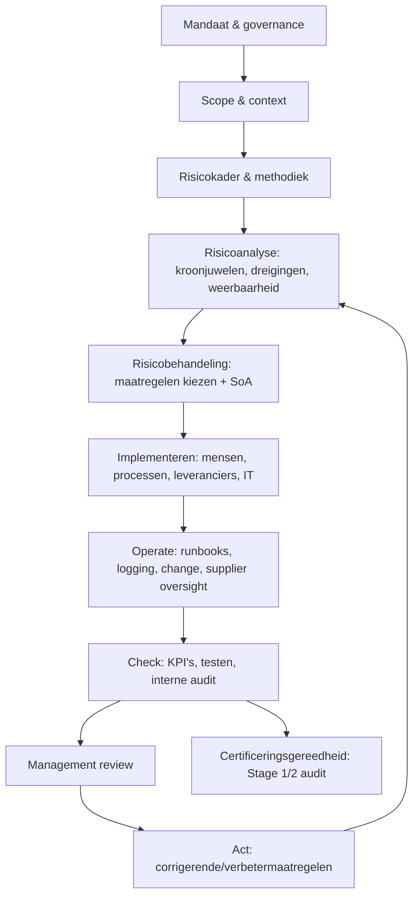
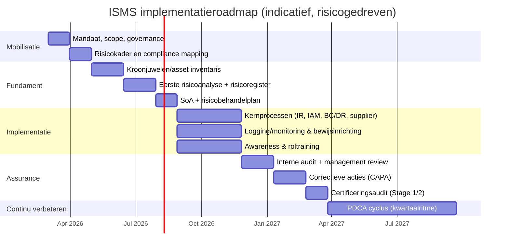

# CONCRETE STAPPEN VOOR ISMS implementatie
Elke stap is genummerd, concreet beschreven met deliverables, rollen, tips, risico's en bewijzen, gebaseerd op de PDCA-cyclus voor een risicogedreven ISMS (ISO 27001/NEN-EN-ISO/IEC 27001) in gemeentelijke context, inclusief NIS2/BIO2/ENSIA.  Tijdsindicaties zijn realistisch voor een middelgrote gemeente (totaal 12-18 maanden), met nadruk op bewijsbaarheid en leveranciersintegratie. [ppl-ai-file-upload.s3.amazonaws](https://ppl-ai-file-upload.s3.amazonaws.com/web/direct-files/attachments/135411255/8fa4ee56-0b45-4543-bbf1-690c108ad19d/ONDERZOEK-VERVOLG-IMS-2.md)

## Plan-Fase (4-10 weken)
1. **Bestuurlijk mandaat vaststellen.** Organiseer MT-vergadering voor besluit over ISMS-doelen, risicobereidheid, budget en scope-principes; borg bestuurlijke oversight (NIS2 art. 20). Deliverable: ISMS-charter (doel, rollen, stuurgroep-ritme). Rol: Directie/DG Bedrijfsvoering. Tip: Koppel aan ENSIA-verantwoording; gebruik template met versiebeheer. Risico: Aandacht verdampt – mitigeer met maandelijks MT-ritme. Bewijs: Vastgesteld besluit. [ppl-ai-file-upload.s3.amazonaws](https://ppl-ai-file-upload.s3.amazonaws.com/web/direct-files/attachments/135411255/8fa4ee56-0b45-4543-bbf1-690c108ad19d/ONDERZOEK-VERVOLG-IMS-2.md)
2. **Scope en context definiëren.** Selecteer minimum viable scope (1-3 kritieke processen, bijv. burgerzaken, servicedesk; incl. locaties/systemen/leveranciersinterfaces). Inventariseer stakeholders (AVG, NIS2, BIO2, ketenpartners). Deliverable: Scope-statement en compliance-register. Rol: ISMS-manager/CISO. Tip: Maak scopekaart met CMDB-extract; freeze na MT-goedkeuring. Risico: Scope-creep – changeboard met risico-kostenanalyse. Bewijs: Scopekaart/CMDB. [ppl-ai-file-upload.s3.amazonaws](https://ppl-ai-file-upload.s3.amazonaws.com/web/direct-files/attachments/135411255/65463b08-b397-462a-a3bd-b01ee4860365/ONDERZOEK-VERVOLG-IMS.md)
3. **Governance en risicokader inrichten.** Definieer RACI (CISO coördineert, proceseigenaren beslissen risico's); kies risicomethode (ISO 27005-stijl: matrix met impactklassen dienstverlening/privacy/financieel, kans-schaal, acceptatiecriteria). Deliverable: Rollenbeschrijving, risicobeleid. Rol: CISO met DPO/inkoop/IT-architect. Tip: Koppel aan budget/change-portfolio; train bestuurders (NIS2). Risico: Onduidelijke eigenaarschap – escalatiepaden vastleggen. Bewijs: Goedgekeurd beleid. [ppl-ai-file-upload.s3.amazonaws](https://ppl-ai-file-upload.s3.amazonaws.com/web/direct-files/attachments/135411255/65463b08-b397-462a-a3bd-b01ee4860365/ONDERZOEK-VERVOLG-IMS.md)
4. **ISMS-jaarplan opstellen.** Plan fasen met deliverables en mijlpalen. Deliverable: Jaarplan met stakeholder-register. Rol: ISMS-manager. Tip: Gebruik GRC-tool voor workflow; align met ENSIA. Bewijs: Vastgesteld plan. [ppl-ai-file-upload.s3.amazonaws](https://ppl-ai-file-upload.s3.amazonaws.com/web/direct-files/attachments/135411255/8fa4ee56-0b45-4543-bbf1-690c108ad19d/ONDERZOEK-VERVOLG-IMS-2.md)

## Do-Fase (4-9 maanden)
5. **Kroonjuwelen en assets inventariseren.** Identificeer kritieke assets/processen (bijv. sociaal domein, belastingen) met eigenaren en classificatie (BIV-niveaus). Deliverable: Asset-inventaris. Rol: Proceseigenaren/IT. Tip: Workshop met domeineigenaren; koppel aan CMDB incl. SaaS. Risico: Incomplete data – automatische discovery-tool. Bewijs: Workshop-notulen/inventaris. [ppl-ai-file-upload.s3.amazonaws](https://ppl-ai-file-upload.s3.amazonaws.com/web/direct-files/attachments/135411255/8fa4ee56-0b45-4543-bbf1-690c108ad19d/ONDERZOEK-VERVOLG-IMS-2.md)
6. **Risicoanalyse uitvoeren.** Beoordeel dreigingen/weerbaarheid per asset; score risico's. Deliverable: Risicoregister (risico, owner, score). Rol: CISO/processeigenaren. Tip: Start bij top-10 risico's; betrek leveranciersafhankelijkheden. Risico: Subjectieve scoring – standaardmatrix hanteren. Bewijs: Actuele register met audittrail. [ppl-ai-file-upload.s3.amazonaws](https://ppl-ai-file-upload.s3.amazonaws.com/web/direct-files/attachments/135411255/65463b08-b397-462a-a3bd-b01ee4860365/ONDERZOEK-VERVOLG-IMS.md)
7. **Risicobehandeling plannen.** Kies maatregelen (Annex A/BIO2); motiveer in SoA (wel/niet toepasbaar). Deliverable: Risk treatment plan/SoA. Rol: ISMS-manager. Tip: Prioriteer NIS2-must-haves (supply chain, MFA); relationele koppeling risico-maatregel. Bewijs: SoA met evidence-links. [ppl-ai-file-upload.s3.amazonaws](https://ppl-ai-file-upload.s3.amazonaws.com/web/direct-files/attachments/135411255/65463b08-b397-462a-a3bd-b01ee4860365/ONDERZOEK-VERVOLG-IMS.md)
8. **Kernmaatregelen implementeren.** Rol uit: incident handling (24/72-uurs meldproces), IAM/MFA/RBAC, logging/SIEM (retention/use cases), change/patch/vuln-management, backup/DR-testen (RTO/RPO), supplier security (classificatie, addendum met logging/incident-meldplicht), awareness/training (rolgebaseerd, incl. bestuur). Deliverable: Procedures/runbooks, configs/trainingrecords. Rol: IT/security/HR/inkoop. Tip: Bouw bewijs in (eigenaar, runbook, KPI, bron zoals logs/tickets); test MFA-coverage >90%. Risico: Compliance i.p.v. risico – toets op reductie. Bewijs: Tickets/configs/logs. [ppl-ai-file-upload.s3.amazonaws](https://ppl-ai-file-upload.s3.amazonaws.com/web/direct-files/attachments/135411255/8fa4ee56-0b45-4543-bbf1-690c108ad19d/ONDERZOEK-VERVOLG-IMS-2.md)

## Check-Fase (6-10 weken initieel, cyclisch)
9. **KPIs monitoren.** Definieer/track: patch-SLA, MFA-dekking, MTTR-incidenten, log-completeness. Deliverable: KPI-rapportage/dashboards. Rol: CISO/SOC. Tip: Escalatie bij drempels (bijv. patch <95%); SIEM-dashboards. Risico: Onduidelijke KPIs – koppel aan besluiten. Bewijs: Dashboards/trends. [ppl-ai-file-upload.s3.amazonaws](https://ppl-ai-file-upload.s3.amazonaws.com/web/direct-files/attachments/135411255/8fa4ee56-0b45-4543-bbf1-690c108ad19d/ONDERZOEK-VERVOLG-IMS-2.md)
10. **Interne audits uitvoeren.** Plan/uitvoeren op scope/controls; rapporteer findings/CAPA. Deliverable: Auditrapporten. Rol: Internal audit. Tip: ENSIA-alignment voor single audit; focus op evidence-gaps. Bewijs: Rapport met sluiting. [ppl-ai-file-upload.s3.amazonaws](https://ppl-ai-file-upload.s3.amazonaws.com/web/direct-files/attachments/135411255/65463b08-b397-462a-a3bd-b01ee4860365/ONDERZOEK-VERVOLG-IMS.md)
11. **Management review houden.** Review prestaties/risico's/afwijkingen/resources; neem besluiten. Deliverable: Notulen/besluitenlijst. Rol: MT. Tip: Kwartaalritme; NIS2-training integreren. Bewijs: Besluiten. [ppl-ai-file-upload.s3.amazonaws](https://ppl-ai-file-upload.s3.amazonaws.com/web/direct-files/attachments/135411255/8fa4ee56-0b45-4543-bbf1-690c108ad19d/ONDERZOEK-VERVOLG-IMS-2.md)
12. **Testen en oefenen.** Tabletop/technische tests voor IR/BC/DR/meldketens. Deliverable: Oefenrapporten. Rol: CISO/crisismanagement. Tip: Simuleer NIS2-meldtermijnen; meet RTO. Bewijs: Resultaten. [ppl-ai-file-upload.s3.amazonaws](https://ppl-ai-file-upload.s3.amazonaws.com/web/direct-files/attachments/135411255/8fa4ee56-0b45-4543-bbf1-690c108ad19d/ONDERZOEK-VERVOLG-IMS-2.md)

## Act-Fase (4-12 weken initieel, doorlopend)
13. **CAPA afhandelen.** Oorzaakanalyse, fix, her-test; sluit findings. Deliverable: CAPA-register. Rol: Proceseigenaren. Tip: SLA (90% binnen termijn); portfolio-tool. Risico: Open findings – escalatie MT. Bewijs: Sluitingsgraad. [ppl-ai-file-upload.s3.amazonaws](https://ppl-ai-file-upload.s3.amazonaws.com/web/direct-files/attachments/135411255/8fa4ee56-0b45-4543-bbf1-690c108ad19d/ONDERZOEK-VERVOLG-IMS-2.md)
14. **Risico's herijken.** Bij changes/incidenten/ketenwijzigingen. Deliverable: Bijgewerkte register/SoA. Rol: CISO. Tip: Triggers definiëren (grote incidents). Bewijs: Updates. [ppl-ai-file-upload.s3.amazonaws](https://ppl-ai-file-upload.s3.amazonaws.com/web/direct-files/attachments/135411255/8fa4ee56-0b45-4543-bbf1-690c108ad19d/ONDERZOEK-VERVOLG-IMS-2.md)
15. **Certificering voorbereiden.** Mock audit, evidence-walkthrough. Deliverable: Certificeringsplan. Rol: ISMS-manager. Tip: Optioneel; focus Stage 1/2. Bewijs: Auditresultaten. [ppl-ai-file-upload.s3.amazonaws](https://ppl-ai-file-upload.s3.amazonaws.com/web/direct-files/attachments/135411255/8fa4ee56-0b45-4543-bbf1-690c108ad19d/ONDERZOEK-VERVOLG-IMS-2.md)
16. **Verbeteren en optimaliseren.** Lessons learned, keten-oefeningen (exitplannen), maturity-trends. Deliverable: Verbeterbacklog. Rol: Alle eigenaren. Tip: Jaar-op-jaar minder high risks; vendor lock-in checken. Bewijs: Trends. [ppl-ai-file-upload.s3.amazonaws](https://ppl-ai-file-upload.s3.amazonaws.com/web/direct-files/attachments/135411255/65463b08-b397-462a-a3bd-b01ee4860365/ONDERZOEK-VERVOLG-IMS.md)

## Ondersteunende Elementen
- **Tooling:** GRC (risico/SoA/CAPA), CMDB, IAM, SIEM, ITSM, supplier-register; automatiseer evidence-harvesting. [ppl-ai-file-upload.s3.amazonaws](https://ppl-ai-file-upload.s3.amazonaws.com/web/direct-files/attachments/135411255/8fa4ee56-0b45-4543-bbf1-690c108ad19d/ONDERZOEK-VERVOLG-IMS-2.md)
- **Leveranciers:** Classificeer (kritiek/hoog), addendum met ISO-eisen/doorwerking onderaannemers (PvE RISSIS), jaarbeoordeling. [ppl-ai-file-upload.s3.amazonaws](https://ppl-ai-file-upload.s3.amazonaws.com/web/direct-files/attachments/135411255/8fa4ee56-0b45-4543-bbf1-690c108ad19d/ONDERZOEK-VERVOLG-IMS-2.md)
Succes: Actueel risicobeeld, SoA-evidence, <5% open findings, NIS2-conforme ketens. [ppl-ai-file-upload.s3.amazonaws](https://ppl-ai-file-upload.s3.amazonaws.com/web/direct-files/attachments/135411255/65463b08-b397-462a-a3bd-b01ee4860365/ONDERZOEK-VERVOLG-IMS.md)

# UITGEBREID ONDERZOEK HIERONDER
# Risicogedreven implementatie van een ISMS voor ISO 27001 bij Nederlandse gemeenten

## Executive summary

Een werkend Information Security Management System (ISMS) voor een gemeente is in de kern een **bestuurlijk gestuurd, risicogedreven en aantoonbaar** managementsysteem dat beleid, mensen, processen, leveranciers en IT samenbrengt en continu verbetert (PDCA). citeturn17view0turn36view0  
Voor ISO 27001 (in Nederland praktisch: NEN‑EN‑variant) zijn de “minimum vereisten” niet een lange set policies, maar een **gesloten keten van besluitvorming → risicoanalyse → selectie/implementatie van maatregelen → monitoring/audits → verbeteracties**, met bewijs dat dit ook echt werkt. citeturn17view0turn36view0turn35view0  
Voor gemeenten komt daar een tweede realiteit bovenop: de **overheidsnormatiek en verantwoording** (BIO/BIO2 en ENSIA) vragen expliciet om aantoonbaarheid richting bestuur/raad en toezichthouders, en sluiten inhoudelijk aan op ISO 27001/27002. citeturn38view0turn37view0turn37view1  
Tegelijkertijd verschuift de wettelijke druk: de entity["organization","Europese Unie","supranational union"] vereist via NIS2 een set governance-, risico- en meldverplichtingen (incl. supply-chain security en incidentmeldtermijnen) en Nederland werkt dit uit in de Cyberbeveiligingswet, met beoogde inwerkingtreding in Q2 2026. citeturn25view0turn39view0turn22view0turn21view0  
Een gemeente kan ISO 27001 slim inzetten als **“besturings- en bewijslaag”** die tegelijkertijd: (a) ISO-certificering mogelijk maakt, (b) BIO2/ENSIA-verantwoording structureert, en (c) NIS2/Cbw-eisen operationaliseert zonder een extra parallel systeem. citeturn38view0turn37view0turn25view0  
Praktisch betekent dit: kies een scherpe scope, leg eigenaarschap vast (informatie-eigenaren/proceseigenaren), bouw één centrale bewijs- en verbeterstroom (audittrail), en behandel leveranciers als integraal onderdeel van je risicobehandeling (niet als bijlage). citeturn36view0turn28view0turn25view0  
Qua doorlooptijd is er geen “universeel” getal; externe bronnen noemen vaak **ongeveer 6–18 maanden** afhankelijk van grootte/complexiteit/maturiteit. Gebruik dit als bandbreedte, niet als belofte; stuur op meetpunten (maturity, auditresultaten, incidentrespons) in plaats van kalender. citeturn32search0turn28view0  

## Normatieve en wettelijke context

### ISO 27001 als normatief anker in de publieke sector

De entity["organization","International Organization for Standardization","standards body"] beschrijft ISO/IEC 27001 als de bekendste ISMS-standaard; hij definieert eisen waaraan een ISMS moet voldoen en promoot een holistische benadering (mensen, beleid en technologie). citeturn17view0  
In Nederland is relevant dat de actuele Europese/Nederlandse aanduiding “NEN‑EN‑ISO/IEC 27001:2023” inhoudelijk gelijk is aan de mondiale ISO/IEC 27001:2022 (met Europees voorwoord). citeturn35view0  

Voor overheden is ISO 27001 bovendien geen vrijblijvende “best practice”: entity["organization","Forum Standaardisatie","nl public standards board"] plaatst NEN‑ISO/IEC 27001 op de ‘Pas toe of leg uit’-lijst en beschrijft expliciet dat deze moet worden toegepast voor het formuleren van eisen voor het **vaststellen, implementeren, bijhouden en continu verbeteren** van een ISMS én voor het vaststellen van de scope. citeturn36view0  

### BIO2, ENSIA en de gemeentelijke verantwoordingslogica

De BIO2 weerspiegelt de internationale normen (NEN‑EN‑ISO/IEC 27001 en 27002) en verschuift expliciet naar een **risicogerichte benadering**. citeturn38view0  
Voor gemeenten is daarnaast **verantwoording** een organisatieproces: Digitale Overheid beschrijft dat overheidsorganisaties via o.a. de Verklaring van Toepasselijkheid inzicht geven in getroffen maatregelen en dat gemeenten via ENSIA “in één keer slim” verantwoording afleggen over informatieveiligheid, inclusief horizontale verantwoording richting gemeenteraad. citeturn37view0turn37view1  

### NIS2, Cyberbeveiligingswet, AVG, DORA en de EU Cybersecurity Act

NIS2 verplicht (op EU-niveau) dat essentiële en belangrijke entiteiten passende technische/operationele/organisatorische maatregelen nemen op basis van risico’s (art. 21), inclusief supply-chain security, incident handling, business continuity, kwetsbaarheidsafhandeling, training en MFA waar passend. citeturn25view0  
NIS2 verplicht ook meldingen bij significante incidenten met termijnen (early warning binnen 24 uur, melding binnen 72 uur, eindrapport binnen één maand). citeturn25view0  

Nederland zet NIS2 om via de Cyberbeveiligingswet; de overheid communiceert dat de beoogde inwerkingtreding Q2 2026 is (afhankelijk van parlementaire behandeling) en dat verplichtingen voor entiteiten in Nederland vanaf inwerkingtreding gelden. citeturn39view0turn22view0turn21view0  
Belangrijk voor gemeenten: het kabinet heeft aangekondigd NIS2 ook van toepassing te laten zijn op lokale overheden (gemeenten/provincies/waterschappen), terwijl NIS2 zelf ruimte laat voor nationale keuze rond lokale bestuurslagen. citeturn39view0turn24view2  

De AVG (GDPR) vereist “passende technische en organisatorische maatregelen” en noemt o.a. beveiliging passend bij risico’s, en het **regelmatig testen, beoordelen en evalueren** van effectiviteit als onderdeel van beveiliging van verwerking. citeturn3view0  
DORA (voor de financiële sector) is sinds 17 januari 2025 van toepassing; relevant voor gemeenten vooral waar gemeentelijke entiteiten/activiteiten binnen DORA-sferen vallen (bv. financiële instellingen/uitbestedingsketens), maar de systematiek (ICT risk management, incidentrapportage, third‑party oversight) is conceptueel sterk ISMS-congruent. citeturn27view0  
De EU Cybersecurity Act beoogt o.a. een **Europees cybersecurity-certificeringskader** om fragmentatie te verminderen en certificaten EU-breed te laten werken. Dit kan in aanbestedingen en leverancierskeuzes steeds vaker een rol spelen. citeturn44view0  

## ISO 27001 en NIST CSF vergeleken

### Verschil in doel en “bewijsregime”

ISO 27001 is een **certificeerbare** managementsysteemnorm: je moet aantonen dat je een ISMS hebt ingericht dat risico’s beheerst en continu verbetert. citeturn17view0turn35view0  
De entity["organization","National Institute of Standards and Technology","us standards agency"] Cybersecurity Framework (CSF) 2.0 is primair een **taxonomie van gewenste cybersecurity outcomes** (CSF Core), met Profielen en Tiers; het document beschrijft wat je wilt bereiken, maar schrijft niet voor hoe je dat precies moet doen. citeturn41view0turn42view1  

Concreet: ISO 27001 vraagt “toon je ISMS werkt” (auditeerbaar), NIST CSF helpt “structureer je doelen en maturiteit” (stuur- en communicatieraamwerk). In een gemeente werken ze samen: ISO 27001 als **governance + audittrail**, CSF als **communicatie- en maturitylaag** richting bestuur en ketenpartners.

### Structuur: PDCA versus Functions

Een ISO‑gedreven implementatie volgt PDCA (Plan‑Do‑Check‑Act). NIST CSF 2.0 organiseert uitkomsten langs zes Functions: Govern, Identify, Protect, Detect, Respond, Recover. citeturn42view1turn42view3  
Een praktische mapping:

- **Plan** ↔ Govern + Identify (risicostrategie, context, assets, leveranciers, prioritering). citeturn42view1turn42view3  
- **Do** ↔ Protect + (delen van) Detect (maatregelen implementeren, basishygiëne, IAM, logging/monitoring). citeturn25view0turn42view3  
- **Check** ↔ Detect + Govern (monitoren, meten, audits, effectiviteit). citeturn42view3turn3view0  
- **Act** ↔ Respond + Recover + Govern (incidentafhandeling, herstel, verbetermaatregelen, management review). citeturn25view0turn42view2  

### Relevantie voor NIS2 en gemeenten

NIS2 vereist expliciet governance en training op bestuursniveau (art. 20), en een set risicobeheersmaatregelen (art. 21) die dicht tegen ISO Annex A/BIO2 aanligt (incident handling, BC/DR, supply chain, cryptografie, HR security, access control, asset management, MFA). citeturn25view0turn24view3turn38view0  
ENISA publiceert daarnaast guidance die juridische eisen omzet naar implementatieparameters, voorbeelden van “evidence” en mappings naar (inter)nationale standaarden — bruikbaar als bewijs-accelerator. citeturn49view0turn33search4  

## Risicogedreven PDCA-implementatie van een ISMS

Onderstaande flowchart is de “theoretische vereistenroute”: van begin tot eind, inclusief bewijsvoering. Dit is bewust **risk-first** (kroonjuwelen → dreigingen → maatregelen) en sluit aan bij Nederlandse overheidspraktijk (BIO2/ENSIA). citeturn28view0turn38view0turn37view1  

### Plan

**Doel**  
Een bestuurlijk vastgesteld ISMS neerzetten: scope, spelregels, risicokader en prioriteiten. Zonder dit wordt “maatregelen implementeren” een willekeurige lijst. citeturn36view0turn25view0turn28view0  

**Concrete activiteiten**  
Maak dit expliciet en auditwaardig:

- **Mandaat**: besluitvorming door directie/college/MT over doelstellingen, risicobereidheid en middelen; borg dat bestuurders hun rol (training/oversight) kunnen invullen zoals de NIS2‑systematiek vraagt. citeturn24view3turn39view0  
- **Scope & grenzen**: bepaal welke organisatieonderdelen, processen, locaties, informatiesystemen en leveranciers binnen scope vallen; definieer interfaces met samenwerkingsverbanden/ketenpartners. citeturn36view0turn17view0  
- **Context & stakeholders**: inventariseer eisen van wetgeving (AVG/NIS2), BIO(2), ENSIA-stelsels en ketenafspraken. citeturn3view0turn37view1turn38view0turn25view0  
- **ISMS governance**: rolverdeling (CISO/ISMS-manager, proceseigenaren, informatie-eigenaren), besluitvormingsritme (stuurgroep), escalatiepaden, uitzonderingbeheer (“risk acceptance”). citeturn28view0turn36view0  
- **Risicomanagement-architectuur**: kies methode (bijv. ISO 27005-stijl, gemeentelijke variant), definieer risicomatrix, scoring, criteria voor acceptatie/mitigatie en koppeling aan budget/changeportfolio. citeturn28view0  

**Benodigde rollen/competenties**  
- Bestuurlijk opdrachtgever (DG/secretaris/directeur bedrijfsvoering) met mandaat en prioriteringsmacht. citeturn25view0turn39view0  
- CISO/ISMS‑manager (GRC, risicomanagement, auditvaardig schrijven, stakeholdermanagement). citeturn28view0  
- Juridisch/Privacy (DPO/FG) voor interpretatie AVG en verwerkersketen. citeturn3view0  
- Inkoop/contractmanagement voor ‘security-by-contract’ en leveranciersscope. citeturn25view0turn48view0  
- IT/OT architectuur en operations (assetzicht, logging, change, IAM). citeturn25view0turn28view0  

**Verwachte deliverables**  
Minimaal: ISMS‑charter/mandaat, scope statement, stakeholder & compliance register, risicomanagementbeleid/methodiek, rollenbeschrijving, ISMS‑jaarplan. citeturn36view0turn28view0turn37view0  

**Tijdsindicatie (bandbreedte)**  
- Klein: ~2–6 weken  
- Middel: ~4–10 weken  
- Groot/complex (meerdere diensten/ketens): ~6–12 weken  
Onzekerheid komt vooral door scope-discussies en datakwaliteit (assetregister) — niet door schrijven van documenten. citeturn28view0  

**Middelen/tools**  
GRC-/ISMS‑tool (of minimaal: centraal register + workflow), CMDB/assetinventaris, contractregister, documentbeheer met versiebeheer, eenvoudige KPI‑dashboards.

**Toprisico’s en mitigaties**  
- **Scope creep** → “scope freeze” na MT‑besluit; wijzigingen alleen via changeboard met risico-/kostenimpact.  
- **Papier-ISMS** → verplicht per deliverable: owner, operating cadence, bewijsbron, KPI.

**Meetbare succescriteria**  
- Scope is formeel vastgesteld en getest op auditbaarheid (begrensd, inclusief interfaces). citeturn36view0  
- Alle kritieke stakeholder-eisen zijn traceerbaar naar ISMS‑onderdelen.  
- Risicokader inclusief acceptatiecriteria is goedgekeurd door bestuur/MT. citeturn39view0turn28view0  

### Do

**Doel**  
Risico’s daadwerkelijk behandelen door passende maatregelen te implementeren en te laten werken in de dagelijkse operatie — inclusief leveranciers en menselijk gedrag. citeturn17view0turn25view0turn28view0  

**Concrete activiteiten**  
Dit is waar ISMS’en vaak stuklopen: niet op “wat”, maar op “hoe borg je het”.

- **Risicoanalyse uitvoeren**: start bij te beschermen belangen (“kroonjuwelen”), dreigingen, huidige weerbaarheid; betrek proceseigenaren (sociaal domein, burgerzaken, belastingen, ruimtelijk). citeturn28view0  
- **Risicobehandeling**: kies maatregelen (ISO Annex A / BIO2 overheidsmaatregelen) en leg vast waarom iets wel/niet van toepassing is in de Verklaring van Toepasselijkheid (SoA). citeturn35view0turn38view0turn37view0  
- **Leveranciers in scope**: identificeer directe leveranciers, afhankelijkheden en contractafspraken; NIS2 eist expliciet supply-chain security als onderdeel van risicobeheersing. citeturn25view0turn28view0  
- **Implementeren van kernprocessen** (minimaal werkend ISMS):
  - incident handling + meldproces (24/72 uur‑logica als voorbereiding) citeturn25view0turn39view0  
  - change- en patchmanagement, kwetsbaarheidsafhandeling  
  - IAM/MFA, RBAC/least privilege  
  - logging/monitoring (detectie en forensics‑basis)  
  - backup/restore + DR‑testketen  
  - awareness en rolgebaseerde training (bestuur + medewerkers) citeturn25view0turn24view3  
- **Bewijs inbouwen**: elke maatregel krijgt (a) eigenaar, (b) runbook/procedure, (c) meetpunt, (d) bewijsbron (log, ticket, auditrapport, trainingregistratie). Dit sluit aan op “regelmatig testen/beoordelen/evalueren” die de AVG expliciet maakt. citeturn3view0  

**Benodigde rollen/competenties**  
- Proceseigenaren (beslisbevoegd over risicoacceptaties binnen hun domein).  
- Security engineers/architecten (IAM, logging, cloud, endpoint).  
- SOC/monitoringfunctie (intern of shared/Dienstverlener).  
- Inkoop/contractmanagement + leveranciersmanager (TPRM).  
- HR/Communicatie (veilig gedrag, onboarding/offboarding). citeturn28view0  

**Verwachte deliverables**  
Risk register, risk treatment plan, SoA, beleidsset + kernprocedures (IR, BC/DR, access control, supplier security), implementatiebewijzen, trainingrecords, technische configuratie-standaarden. citeturn35view0turn25view0turn38view0  

**Tijdsindicatie (bandbreedte)**  
- Klein: ~3–6 maanden  
- Middel: ~4–9 maanden  
- Groot/complex: ~6–12+ maanden  
Externe bronnen noemen vaak 6–18 maanden totaal voor implementatie afhankelijk van complexiteit; gebruik dat als grove bandbreedte. citeturn32search0  

**Middelen/tools**  
- GRC/ISMS workflow (risico’s, SoA, auditfindings, exceptions)  
- IAM (MFA, lifecycle, privileged access)  
- Vulnerability management + patch compliance  
- Logging/SIEM + retention + use cases  
- Backup/restore tooling met testautomatisering  
- Supplier security tooling (questionnaires, attestations, contractclauses)

**Toprisico’s en mitigaties**  
- **Verkeerde maatregelkeuze (compliance i.p.v. risico)** → begin bij kroonjuwelen en dreigingen; toets elke maatregel op risicoreductie en “bewijsbaar werken”. citeturn28view0  
- **Leveranciers buiten beeld** → contractueel en operationeel leveranciersproces; voorbeelden uit gemeentelijke PvE’s laten zien dat ISO‑certificering en eisen expliciet worden uitgevraagd en doorwerken naar onderaannemers. citeturn48view0turn25view0  

**Meetbare succescriteria**  
- ≥90% van kroonjuwelen/procesketens heeft een risico-eigenaar en actuele risicoassessment.  
- SoA is compleet (alle maatregelen overwogen, gemotiveerd) en goedgekeurd. citeturn35view0  
- Herstelbaarheid aantoonbaar: periodieke restore-tests met meetbare RTO/RPO-resultaten.  
- Leveranciers: top‑X kritieke leveranciers hebben security‑eisen + evaluatiecyclus + exitcriteria. citeturn25view0turn48view0  

### Check

**Doel**  
Aantoonbaar maken dat maatregelen effectief zijn, afwijkingen vinden en sturen op verbetering (interne controle). Dit is het verschil tussen “een set controls” en een werkend ISMS. citeturn17view0turn3view0  

**Concrete activiteiten**  
- **Meten & monitoren**: KPI/KRI-set (patch SLA, MFA coverage, incident MTTR, auditlog completeness).  
- **Interne audit**: plan, uitvoering, rapportage, opvolging.  
- **Management review**: formele review van prestaties, risico’s, afwijkingen en resources; dit moet bestuurlijk besluiten opleveren. citeturn17view0turn28view0  
- **Testen/oefenen**: table‑top en technische oefeningen voor incidentresponse en crisis/BC; dit sluit aan op NIS2 (incident handling, business continuity) en AVG (regelmatig testen/evalueren). citeturn25view0turn3view0  
- **ENSIA-alignment**: hergebruik ISMS-bewijs voor horizontale/verticale verantwoording waar mogelijk (single information, single audit). citeturn37view1turn37view0  

**Benodigde rollen/competenties**  
Internal auditor/kwaliteitsfunctie (auditmethodiek), ISMS‑manager (evidence), proceseigenaren (correctieve acties), bestuur/MT (besluitvorming), CISO (risicobeeld). citeturn39view0turn28view0  

**Verwachte deliverables**  
KPI-rapportage, auditprogramma, interne auditrapporten, management review notulen/besluiten, register van afwijkingen/corrective actions, test-/oefenrapporten. citeturn3view0turn37view0  

**Tijdsindicatie (bandbreedte)**  
Initieel (eerste volledige Check-cyclus):  
- Klein: ~4–8 weken  
- Middel: ~6–10 weken  
- Groot: ~8–14 weken  
Daarna cyclisch per kwartaal/halfjaar.

**Middelen/tools**  
Auditmodule (in GRC), evidence repository, SIEM dashboards, vulnerability dashboards, ticketing/ITSM, oefeningen (crisismanagement tooling).

**Toprisico’s en mitigaties**  
- **KPI’s zonder stuurwaarde** → koppel KPI’s aan besluitdrempels (bijv. patch compliance <X% ⇒ escalatie).  
- **Auditfindings blijven liggen** → corrective action SLA + escalatie naar proceseigenaar/MT.

**Meetbare succescriteria**  
- Interne audit afgerond met alle major findings binnen afgesproken termijn gesloten.  
- Management review produceert aantoonbare besluiten (prioriteiten, budget, scope-aanpassingen).  
- Oefeningen tonen dat meld- en herstelketens binnen vereiste tijdvensters kunnen functioneren. citeturn25view0  

### Act

**Doel**  
Continue verbetering inbedden: afwijkingen corrigeren, risico’s herijken, lessons learned omzetten naar structurele verbetering en (indien gewenst) certificering behalen/onderhouden. citeturn17view0turn37view0  

**Concrete activiteiten**  
- **Corrective & preventive actions**: oorzaakanalyse, structurele fix, her-test.  
- **Risicoherijking**: bij grote changes/incidenten/ketenwijzigingen opnieuw beoordelen.  
- **Certificeringsgereedheid**: mock audit, document review, “operational evidence walk-through”. ISO zelf benadrukt dat certificering een manier is om stakeholders vertrouwen te geven; je besluit zelf of je certificeert. citeturn17view0  
- **Ketenoptimalisatie**: vendor lock-in verminderen, exitplannen, gezamenlijke ketenoefeningen. Supply-chain security is expliciet onderdeel van NIS2-maatregelen. citeturn25view0turn49view0  

**Benodigde rollen/competenties**  
CISO/ISMS manager (portfolio), proceseigenaren (structurele verbeteringen), IT/change management, inkoop (contractwijzigingen), communicatie (lessons learned, cultuur).

**Verwachte deliverables**  
Verbeterbacklog, CAPA‑register, bijgewerkte risico’s/SoA, certificeringsplan en auditresultaten (indien van toepassing), updated policies/standaarden.

**Tijdsindicatie (bandbreedte)**  
- Voor eerste “Act”-sluiting na interne audit: 4–12 weken afhankelijk van findings.  
- Certificeringsauditplanning is daarnaast afhankelijk van externe auditorcapaciteit.

**Middelen/tools**  
Portfolio tooling, GRC, change management, leveranciersbeheer, maturity tooling.

**Meetbare succescriteria**  
- Sluitingsgraad CAPA (bijv. >90% binnen SLA).  
- Jaar-op-jaar trend: minder high risks zonder treatment, sneller herstel, betere audituitkomsten.

## Deliverables, templates en bewijsvoering

### Deliverableset voor een minimaal werkend ISMS

Onderstaande tabel is bewust opgezet als **“evidence-first”**: elke deliverable moet (1) een eigenaar hebben, (2) een ritme, (3) een bewijsbron. Dit sluit aan op de overheidspraktijk om via o.a. Verklaring van Toepasselijkheid transparant te zijn over maatregelen. citeturn37view0turn35view0  

| Deliverable | Doel | Minimale template-inhoud | Owner | Bewijs dat auditors accepteren |
|---|---|---|---|---|
| ISMS‑mandaat / charter | Bestuurlijke sturing, scopebesluit | doel, scope, rollen, stuurstructuur, budgetprincipes | Directie/MT | vastgesteld besluit + versiebeheer |
| Scope statement | Auditbare afbakening | in/out, locaties, systemen, keteninterfaces | ISMS‑manager | scopekaart, CMDB‑extract |
| Risicomanagementbeleid & methodiek | Consistente risicobeoordeling | criteria, matrix, acceptatie, reviewcyclus | CISO | goedkeuring + toepassing in registers |
| Asset- & kroonjuweleninventaris | Risico’s aan business koppelen | informatiecategorieën, proceseigenaren, BIV | Proceseigenaren | workshop-notulen + inventaris |
| Risicoregister | Prioritering en sturing | risico, owner, score, treatment, deadline | CISO/owners | actuele status + audit trail |
| Risicobehandelplan | Van risico naar actie | maatregel, eigenaar, planning, residual risk | Owners/IT | implementatietickets, config bewijzen |
| Verklaring van Toepasselijkheid (SoA) | Motiveren welke maatregelen gelden | per maatregel: toepasbaar? status? motivatie | ISMS‑manager | SoA + koppeling naar evidence |
| Kernbeleid & procedures | Operationele borging | IR, BC/DR, IAM, supplier sec, change/patch | Owners | runbooks, ITSM, trainingsrecords |
| Interne auditprogramma & rapporten | Effectiviteit toetsen | scope, criteria, findings, CAPA | Internal audit | auditrapport + CAPA‑sluiting |
| Management review output | Bestuurlijke bijsturing | performance, changes, besluiten, resources | MT | notulen + besluitenlijst |
| ENSIA-alignment map | Single info, single audit | mapping ISMS‑bewijslast → ENSIA vragen | CISO | hergebruik bewijs + raad/college-info citeturn37view1 |

**Template-opmerking (praktisch)**: gebruik één consistent “format” (scope → doel → verantwoordelijk → processtappen → meetpunten → bewijs). Het is innovatiever én goedkoper om templates te modelleren als **data‑objecten in een GRC-tool**, niet als losse Word-documenten; dan voorkom je documentinflatie en creëer je audittrail-by-design.

### Specifiek: leveranciers als first-class deliverable

Gemeentelijke inkooppraktijk laat zien dat leveranciers-eisen vaak expliciet worden vastgelegd: het Model PvE RIS/SIS bevat eisen over doorwerking naar onderaannemers en vraagt een geldig NEN‑EN‑ISO/IEC 27001 certificaat (of gelijkwaardig bewijs) met passende scope. citeturn48view0  
Combineer dit met NIS2’s expliciete supply-chain verplichting. citeturn25view0  

Minimum templates voor leveranciersdomein:
- leveranciersclassificatie (kritiek/hoog/middel/laag)  
- security addendum / control matrix (incl. logging, incidentmeldtermijnen, toegang)  
- jaarlijkse beoordeling + exit/continuïteitsplan  
- bewijs: certificaten/attestaties, pentestrapporten, incidentrapportages, SLA dashboards

## Tooling en middelen

Tooling is geen ISMS; tooling is de **mechaniek** om PDCA te laten draaien met minimale overhead.

### Toolingprincipes

- **Eén bron van waarheid voor risico’s en bewijs**: GRC/ISMS-tool of strak geregisseerd “lightweight” alternatief. NIST CSF beschrijft expliciet dat Profiles/Tiers helpen om posture te beschrijven en gaps te bepalen; tooling maakt dat herhaalbaar. citeturn41view0turn42view0  
- **Workflow boven document**: bewijs zit in logs/tickets/config states, niet in policy‑PDF’s.  
- **Automatiseer meetbaarheid**: patch compliance, MFA coverage, backup restore tests, logging coverage.

### Minimale toolstack per domein

- **Governance & compliance**: GRC/ISMS module (risico, SoA, audit, CAPA, uitzonderingen).  
- **Asset & configuratie**: CMDB/asset discovery (ook SaaS), koppeling naar informatieclassificatie.  
- **Identity & access**: MFA, lifecycle, privileged access; past bij NIS2 (MFA waar passend). citeturn25view0  
- **Vulnerability & patch**: scanning + remediation workflow; dashboards.  
- **Logging & monitoring**: centrale logging/SIEM, use cases, retention en toegangsbeheer.  
- **Incident response**: playbooks, meldprocessen (24/72 uur‑keten), oefenlog. citeturn25view0turn39view0  
- **Leveranciersbeheer**: contractregister + security assessments + bewijsopslag.

### Slimme versneller: hergebruik van sector-/publieke toolingconcepten

Een voorbeeld uit de praktijk (NL): entity["organization","SURF","nl education ict cooperative"] beschrijft dat zij een ISMS met cyclische processen runt (interne audits, self-assessments) en op ISO‑kader stuurt; ook wordt een GRC‑applicatie expliciet genoemd als middel om maturiteit te documenteren en risicogebaseerd te verbeteren. citeturn46view0turn34search3  
Voor gemeenten is de les: kies tooling die **assurance** (auditbaar bewijs) ondersteunt, niet alleen “control checklists”.

## Implementatieroadmap en schaalvarianten

### Roadmap in fasen

Onderstaande roadmap is ontworpen om tegelijk ISO‑certificering, BIO2/ENSIA en NIS2/Cbw‑voorbereiding te bedienen, zonder dubbele administratie. citeturn38view0turn37view1turn39view0turn25view0  

**Let op**: data zijn placeholders; startdatum/budget/tijdsdruk zijn niet gespecificeerd. De roadmap is daarom “vormvast” (fasen en afhankelijkheden), maar tijdvakken zijn bandbreedtes.

### Aanpassingen voor klein, middel en groot

**Klein (bijv. beperkte IT, veel shared services)**  
- Scope klein houden (kritieke processen + kernsystemen) en leveranciers streng classificeren; je wint het op contract- en ketensturing.  
- Tooling: lightweight GRC + sterke bewijsdiscipline (ITSM + logging).  
- Risiko: afhankelijkheid van één leverancier; mitigatie: exitplan + continuïteitstest.

**Middel (meerdere domeinen, hybride IT, regionaal samenwerken)**  
- Richt een echte “three lines” in (proceseigenaar → CISO/GRC → internal audit).  
- Versnel door standaardmaatregelen (BIO2) als baseline te nemen en daarop extra risico-gedreven op te schalen. citeturn38view0  

**Groot (complexe ketens, veel applicaties, meerdere uitvoeringsorganisaties)**  
- Multi-scope of domeinscopes met één overkoepelend ISMS; anders wordt governance onbestuurbaar.  
- Investeer vroeg in asset discovery, logging-architectuur en leveranciersportfolio (concentratierisico).  
- Organiseer “bewijs-as-a-service”: automatische evidence harvesting uit IAM/CMDB/SIEM.

### Praktijkcases die de aanpak concretiseren

- entity["state","Provincie Zeeland","nl province"] communiceert dat zij als eerste provincie haar gehele bedrijfsvoering ISO 27001‑gecertificeerd heeft en beschrijft dat dit o.a. vroeg om bewustwording bij medewerkers, technologische maatregelen en het inrichten van bedrijfsprocessen — precies de triade die ISO als holistisch benoemt. citeturn46view1turn17view0  
- Gemeentelijke aanbestedingspraktijk: het PvE RIS/SIS legt expliciet vast dat informatiebeveiligings- en privacy-eisen doorwerken naar onderaannemers én dat een leverancier een geldig ISO 27001 certificaat (of gelijkwaardig bewijs) moet hebben met passende scope. Dit is een concrete hefboom om leveranciersrisico’s te verlagen en sluit aan op NIS2’s supply-chain focus. citeturn48view0turn25view0  
- Overheidsverantwoording: Digitale Overheid benadrukt dat verantwoording over risicobeheersing plaatsvindt richting bestuur/toezichthouders/burger en dat ENSIA de horizontale verantwoording richting gemeenteraad ondersteunt. Gebruik je ISMS als “single source of truth” en projecteer ENSIA eroverheen. citeturn37view0turn37view1  

### Risico- en mitigatiematrix voor de implementatie

| Implementatierisico | Waar gebeurt het | Impact | Mitigatie (concreet) |
|---|---|---|---|
| Bestuurlijke aandacht verdampt | na kickoff | Hoog | MT‑ritme (maandelijks), management review met besluitpunten; training/oversight conform NIS2‑governancegedachte citeturn24view3turn39view0 |
| Scope te breed (“alles moet”) | Plan/Do | Hoog | start met kroonjuwelen; fasering; scope‑wijzigingen alleen via changeboard met risicobaten |
| Bewijs ontbreekt | Do/Check | Hoog | evidence design per control; automatische harvesting (IAM/ITSM/SIEM) |
| Leveranciers domineren risico | Do | Hoog | kritieke leveranciersportfolio, contractclausules + periodieke beoordeling; certificaat/attestatie waar passend citeturn25view0turn48view0 |
| Overlap BIO/ISO/ENSIA leidt tot administratieve last | Do/Check | Middel | één control library + mapping (ISO ↔ BIO2 ↔ ENSIA), “single information single audit” benadering citeturn37view1turn38view0 |
| Incidentmelding niet haalbaar binnen termijnen | Do/Check | Hoog | meldproces oefenen; runbooks; 24/72 uur keten inrichten en testen citeturn25view0turn39view0 |

### Meetbare succescriteria op eindniveau

Een gemeente kan redelijk objectief zeggen dat het ISMS “werkt” als:

- Er een actueel risicobeeld is met eigenaarschap en behandeling voor de top‑risico’s, inclusief leveranciersrisico’s. citeturn28view0turn25view0  
- De SoA actueel is en aantoonbaar gekoppeld aan bewijsbronnen en verbeteracties. citeturn35view0turn37view0  
- Interne audits en management reviews structureel plaatsvinden en leiden tot aantoonbare besluiten/verbeteringen. citeturn17view0turn37view0  
- Incidentrespons en herstel aantoonbaar functioneren (oefenresultaten, restore-tests), en meldketen voldoet aan NIS2‑logica (voorbereid op Cbw). citeturn25view0turn39view0  
- Verantwoording richting raad en toezichthouders is reproduceerbaar met dezelfde dataset (ENSIA-alignment). citeturn37view1turn37view0